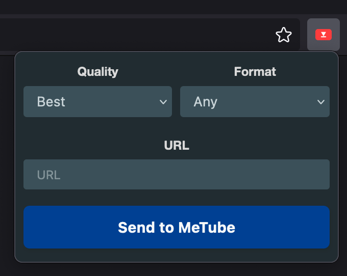
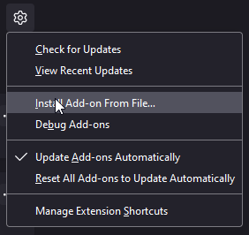

### This is a fork of [metube-firefox-addon](https://github.com/nanocortex/metube-firefox-addon) with support for alternative front-ends like Piped and Invidious

# Firefox MeTube addon

Addon for queueing videos to [MeTube](https://github.com/alexta69/metube) instance.

## Installation from zip

## Usage

Before use you should configure MeTube instance url in addon preferences.
